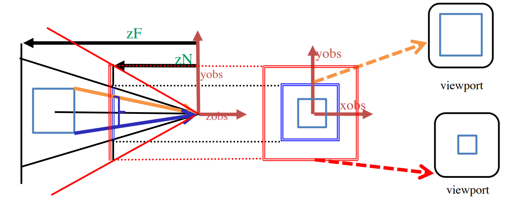
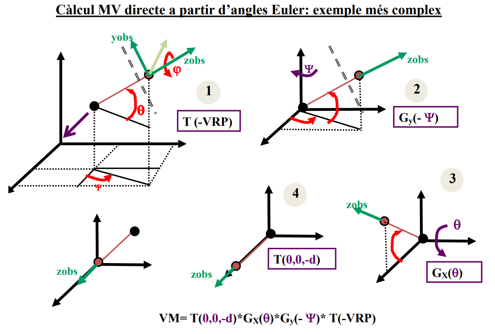

<style>
    h1{
        color: red;
        text-align: center;
        font-size: 50px;
        text-shadow: 2px 2px #ffcccc;
    }
    h2{
        font-weight: bold;
    }
    h3{
        font-weight: bold;
        font-size: 15px;
    }
    img {
        width: 100%;
        height: auto;
    }
    note {
        font-weight: lighter;
    }
    p{
        text-align: justify;
    }
</style>

# Classe 5

## Breu repàs de càmera in tercera persona

* inclogui tota l'escena
* posicio arbitrària de l'observador
* centrada en viewport
* sense deformació (ra<sub>w</sub> = ra<sub>v</sub>)

> Si ra<sub>v</sub> > 1 -> no cal modificar el FOV.
> Si ra<sub>v</sub> > 1 -> cal fer ra*<sub>w</sub> = ra<sub>v</sub> i encrementar el FOV.
>
> FOV = 2*α = 2 * arctg(tg(α<sub>v</sub>)/ra<sub>v</sub>).

<note>  
Capsa mínima contenidora d'escena:

cmin=(xmin, ymin, zmin)

cmax=(xmax, ymax, zmax)
</note>

## Lòptica i el Zoom

* Modificar l'angle d'obertura (mantenint la ra).
 
        modificar window en ortogonal.
* Modificar la distancia entre l'observador i el VRP.
 
        Modificar ZN i ZF.
* Modificar l'observador i el VRP en la direcci-o -v (aka travelling).



## Moure càmera en tercera persona
### MODE INSPECCIÓ

```
VM = lookAt(OBA, VRP, up);
viewMatrix(VM);
```


VRP = Punt d'enfoc.

OBS = VRP+d *v*

d > R
v<sub>y</sub> = sin(Φ); a = cos(Φ)

v<sub>z<sub> = cos(Φ) * cos(ψ)

v<sub>y</sub> = cos(Φ) sin(ψ)



<div class="page">

# Classe 6

## Introducció a la HCI i principis d'usabilitat

**HCI -> Human–computer interaction**

**Usabilitat** -> Habilitat la qual un producte pot ser usat per uns usuaris concrets per tal de fer unes tasques especifiques amb una finalitat, eficientment i satisfactoriament per un entorn especific.

### HCI - Desktop PC

>Gran pantalla

>Mouse

>Teclat

### HCI - Mobile systems

#### Móbils

>Més petits

>Tactil/stylus

>Sense teclat

>Limitacions de software

#### Tablets

>Més grans

>Tactil/stylus

>Sense teclat

>Limitacions de software

## Principis de diseny

[Documentació](https://asktog.com/atc/principles-of-interaction-design/)

Coses que estan a les transpas i que es resumeixen en fer les coses be i de manera moni.