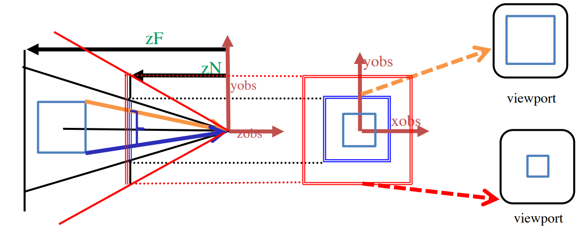
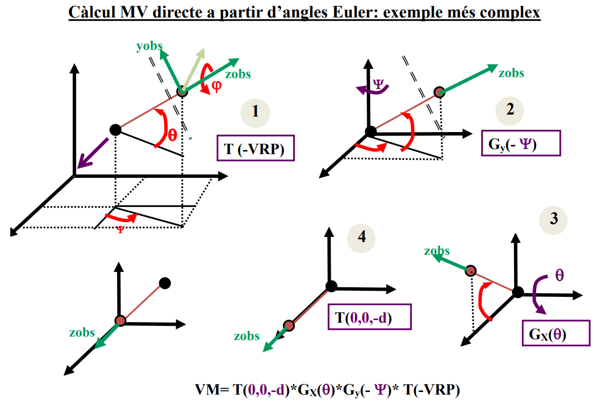
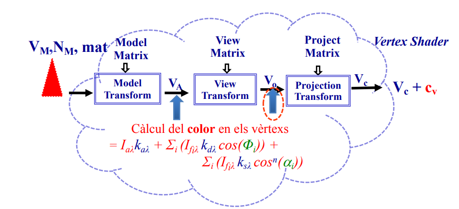
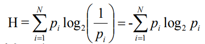

<style>
    h1{
        color: red;
        text-align: center;
        font-size: 50px;
        text-shadow: 2px 2px #ffcccc;
    }
    h2{
        font-weight: bold;
    }
    h3{
        font-weight: bold;
    }
    img {
        height: auto;
        width: 100%;
    }
    note {
        font-weight: lighter;
        background-color: rgba(100, 100, 100, 0.3);
        font-style: italic;
    }
    p{
        text-align: justify;
    }
    img{
        width: 100%;
        height: auto;
    }
    .center{
        width: 50%;
        height: auto;
        margin-left: auto;
        margin-right: auto;
    }
    .mini{
        width: 40%;
        height: auto;
    }
	module{
		border-top: 1px solid;
	}
</style>

# Classe 5

## Breu repàs de càmera in tercera persona

* inclogui tota l'escena
* posicio arbitrària de l'observador
* centrada en viewport
* sense deformació (ra<sub>w</sub> = ra<sub>v</sub>)

> Si ra<sub>v</sub> > 1 -> no cal modificar el FOV.
> Si ra<sub>v</sub> > 1 -> cal fer ra*<sub>w</sub> = ra<sub>v</sub> i encrementar el FOV.
>
> FOV = 2*α = 2 * arctg(tg(α<sub>v</sub>)/ra<sub>v</sub>).

<note>  
Capsa mínima contenidora d'escena:

cmin=(xmin, ymin, zmin)

cmax=(xmax, ymax, zmax)
</note>

## Lòptica i el Zoom

* Modificar l'angle d'obertura (mantenint la ra).
 
		modificar window en ortogonal.
* Modificar la distancia entre l'observador i el VRP.
 
		Modificar ZN i ZF.
* Modificar l'observador i el VRP en la direcci-o -v (aka travelling).



## Moure càmera en tercera persona
### MODE INSPECCIÓ

```
VM = lookAt(OBA, VRP, up);
viewMatrix(VM);
```


VRP = Punt d'enfoc.

OBS = VRP+d *v*

d > R
v<sub>y</sub> = sin(Φ); a = cos(Φ)

v<sub>z<sub> = cos(Φ) * cos(ψ)

v<sub>y</sub> = cos(Φ) sin(ψ)



<div class="page">

# Classe 6

## Introducció a la HCI i principis d'usabilitat

**HCI -> Human–computer interaction**

**Usabilitat** -> Habilitat la qual un producte pot ser usat per uns usuaris concrets per tal de fer unes tasques especifiques amb una finalitat, eficientment i satisfactoriament per un entorn especific.

### HCI - Desktop PC

>Gran pantalla

>Mouse

>Teclat

### HCI - Mobile systems

#### Móbils

>Més petits

>Tactil/stylus

>Sense teclat

>Limitacions de software

#### Tablets

>Més grans

>Tactil/stylus

>Sense teclat

>Limitacions de software

## Principis de diseny

[Documentació](https://asktog.com/atc/principles-of-interaction-design/)

Coses que estan a les transpas i que es resumeixen en fer les coses be i de manera moni.

## Cosa de color

Tu tio tens a la Carla, pregunta i ja. A més està toh wena.

## Cosa de llum

### Model empíric ambient

És el més cutre, la llum arriba la llum igual per tots els costats.

>   **I<sub>λ</sub>(P) = I<sub>aλ</sub> · k<sub>aλ</sub>** on:
>
>   **I<sub>aλ</sub>** és el color de la llum ambient.
>
>   **k<sub>aλ</sub>** és el coeficient de reflexció.

### Model de Lambert

Aquest ja no es tant cutre, mira per on li arriba la llum.

>   **I<sub>λ</sub>(P) = I<sub>fλ</sub>·k<sub>dλ</sub> cos(Φ)** amb Φ > 90° on:
> 
>   **I<sub>fλ</sub>** és el color de la llum del focus puntual f.
>
>   **k<sub>dλ</sub>** és el coeficient de relexió difusa del material.
>
>   **Φ** és el l'angle entre el raig de llum incident i el vector normal de la superfície en el punt P.

### Model de Phong

Aquest ja no es tant cutre, mira per on li arriba la llum.

>   **I<sub>λ</sub>(P) = I<sub>fλ</sub>·k<sub>dλ</sub> cos<sup>n</sup>(α)** amb Φ < 90° on:
> 
>   **I<sub>fλ</sub>** és el color de la llum del focus puntual f.
>
>   **k<sub>dλ</sub>** és el coeficient de relexió difusa del material.
>
>   **α** és el l'angle entre el raig de llum incident i el vector normal de la superfície en el punt P.
>   **n** és l'exponent de reflexió especular [(mirall)](https://mdlc.iec.cat/results.asp?txtEntrada=especular&operEntrada=0)

### Calcul del color

>   **Iλ(P) = I<sub>aλ</sub> * k<sub>aλ</sub> + Σi (I<sub>fiλ</sub> k<sub>dλ</sub> cos(Φ<sub>i</sub>)) + Σi (I<sub>fiλ</sub> K<sub>sλ</sub> cos<sup>n</sup>
(α<sub>i</sub>))**

<div class="page">

# Classe 7

## Models d'il·luminació

Simulen les lleis físiques que determinen el color d'un punt.

* Models locals (els que ja hem vist)
* Models globals (Ray tracing, radiositat)

### Procés de visualtizació

#### Càlcul del color en el Vèrtex



>   I<sub>a</sub> = | <module>posF<sub>A</sub></module> - <module>V<sub>A</sub></module> |
>
>   V<sub>visió<sub>A</sub></sub> = | Pos<sub>obs<sub>A</sub></sub> -  <module>V<sub>A</sub></module> |
>
>   Pos<sub>Obs<sub>O</sub></sub> = (0, 0, 0)

#### Càlcul del color en el Fragment


# Classe 8

## Diseny d'interacció i evaluació

### Incerteses

La incertesa de rebre un cert simbol es log<sub>2</sub>(M), si cada simbol te les mateixes provabilitats d'apareixer.

Si no son equiprovables és:



<div class="page">~~~~

# Classe 9

## Fitts' law in ui design

> MT = a + b·log<sub>2</sub>((D/W)+1)

Posar les coses als edges de la pantalla fa que sigui molt mes facil clicar. W tandeix a ∞

## Crossing

Les interficies crossin-bassed és mes rapid (o igual) que el pointing-based

El rati d'errors és més baix.

## Steering

Multiples crossing creant un path. IDK

Es fan servir amb cose de dibuix

> T<sub>s</sub> = a+b·∫(ds/W(s))

## Pointing devices

>       "El problea d'agafr stylus es que l'has de deixar"

## Usabilitat

### Tests usabilitat

- Determinar problemes d'usabilitat
- Mesurar la "task performance"
  - 